# NOC App - Network Operations Center

[](https://www.typescriptlang.org/)
[](https://nodejs.org/)
[](LICENSE)

Un sistema de monitoreo de red (NOC) construido con TypeScript que supervisa la disponibilidad de servicios web mediante verificaciones programadas usando cron jobs.

## 📋 Tabla de Contenidos

- [Características](#-características)
- [Arquitectura](#-arquitectura)
- [Instalación](#-instalación)
- [Configuración](#-configuración)
- [Uso](#-uso)
- [API Endpoints](#-api-endpoints)
- [Base de Datos](#-base-de-datos)
- [Docker](#-docker)
- [Ejemplos](#-ejemplos)
- [Desarrollo](#-desarrollo)
- [Contribución](#-contribución)

## ✨ Características

- 🔍 **Monitoreo Continuo**: Verificaciones automáticas de servicios web cada 5 segundos
- 📊 **Sistema de Logs**: Registro detallado con niveles de severidad
- 🏗️ **Arquitectura Limpia**: Implementación basada en Clean Architecture
- ⚡ **TypeScript**: Desarrollo type-safe con las últimas características de ES
- 🔄 **Cron Jobs**: Programación flexible de tareas de monitoreo
- 📈 **Escalable**: Diseño modular para fácil extensión

## 🏛️ Arquitectura

El proyecto sigue los principios de Clean Architecture con separación clara de responsabilidades:


### Estructura del Proyecto

```
src/
├── domain/                 # Lógica de negocio
│   ├── entities/          # Entidades del dominio
│   ├── repository/        # Interfaces de repositorios
│   ├── datasources/       # Interfaces de fuentes de datos
│   └── use-cases/         # Casos de uso
├── infrastructure/        # Implementaciones técnicas
│   └── datasources/       # Implementaciones de fuentes de datos
└── presentation/          # Capa de presentación
    ├── cron/             # Servicios de programación
    └── server.ts         # Servidor principal
```

## 🚀 Instalación

### Prerrequisitos

- Node.js 18 o superior
- npm o yarn
- Docker (opcional)

### Instalación Local

```bash
# Clonar el repositorio
git clone https://github.com/tu-usuario/noc-app.git
cd noc-app

# Instalar dependencias
npm install

# Ejecutar en modo desarrollo
npm run dev

# Construir para producción
npm run build

# Ejecutar en producción
npm start
```

## ⚙️ Configuración

### Variables de Entorno

Crea un archivo `.env` en la raíz del proyecto:

```env
# Configuración del servidor
PORT=3000
NODE_ENV=development

# Configuración de monitoreo
CHECK_INTERVAL=*/5 * * * * *
DEFAULT_URL=https://www.google.com

# Configuración de logs
LOG_LEVEL=info
LOG_FILE_PATH=./logs

# Base de datos
DB_HOST=localhost
DB_PORT=5432
DB_NAME=noc_db
DB_USER=noc_user
DB_PASSWORD=noc_password
```

### Configuración de TypeScript

El proyecto utiliza configuración moderna de TypeScript con:

| Opción    | Valor    | Descripción                           |
| --------- | -------- | ------------------------------------- |
| `target`  | `esnext` | Compilación a la última versión de ES |
| `module`  | `esnext` | Uso de módulos ES modernos            |
| `strict`  | `true`   | Verificación estricta de tipos        |
| `baseUrl` | `./src`  | Ruta base para imports                |

## 🎯 Uso

### Inicio Rápido

```typescript
import { Server } from "./presentation/server";

// Iniciar el servidor NOC
Server.start();
```

### Configuración de Monitoreo

```typescript
import { CheckService } from "./domain/use-cases/checks/check-service";
import { CronService } from "./presentation/cron/cron-service";

// Crear servicio de verificación
const checkService = new CheckService(
  () => console.log("✅ Servicio disponible"),
  (error) => console.log("❌ Error:", error)
);

// Programar verificación cada 30 segundos
CronService.createJob("*/30 * * * * *", async () => {
  await checkService.execute("https://mi-servicio.com");
});
```

## 🌐 API Endpoints

### Monitoreo de Servicios

```http
POST /api/v1/checks
Content-Type: application/json

{
  "url": "https://example.com",
  "interval": "*/5 * * * * *"
}
```

**Respuesta:**

```json
{
  "success": true,
  "checkId": "check_123",
  "message": "Monitoreo iniciado correctamente"
}
```

### Obtener Logs

```http
GET /api/v1/logs?level=high&limit=50
```

**Respuesta:**

```json
{
  "logs": [
    {
      "id": "log_456",
      "level": "high",
      "message": "Error on check service https://example.com",
      "createdAt": "2024-01-15T10:30:00Z"
    }
  ],
  "total": 1,
  "page": 1
}
```

### Estados de Servicios

```http
GET /api/v1/status
```

**Respuesta:**

```json
{
  "services": [
    {
      "url": "https://example.com",
      "status": "up",
      "lastCheck": "2024-01-15T10:35:00Z",
      "responseTime": 245
    }
  ],
  "summary": {
    "total": 1,
    "up": 1,
    "down": 0
  }
}
```

## 🗄️ Base de Datos

### Esquema de Base de Datos


### Configuración con Docker

```sql
-- Crear base de datos
CREATE DATABASE noc_db;

-- Crear usuario
CREATE USER noc_user WITH PASSWORD 'noc_password';
GRANT ALL PRIVILEGES ON DATABASE noc_db TO noc_user;

-- Tabla de logs
CREATE TABLE logs (
    id UUID PRIMARY KEY DEFAULT gen_random_uuid(),
    level VARCHAR(10) NOT NULL,
    message TEXT NOT NULL,
    created_at TIMESTAMP DEFAULT CURRENT_TIMESTAMP
);

-- Tabla de servicios
CREATE TABLE services (
    id UUID PRIMARY KEY DEFAULT gen_random_uuid(),
    url VARCHAR(255) NOT NULL,
    name VARCHAR(100),
    active BOOLEAN DEFAULT true,
    cron_pattern VARCHAR(50) DEFAULT '*/5 * * * * *',
    created_at TIMESTAMP DEFAULT CURRENT_TIMESTAMP
);
```

## 🐳 Docker

### Docker Compose

```yaml
version: "3.8"

services:
  noc-app:
    build: .
    ports:
      - "3000:3000"
    environment:
      - NODE_ENV=production
      - DB_HOST=postgres
      - DB_PORT=5432
      - DB_NAME=noc_db
      - DB_USER=noc_user
      - DB_PASSWORD=noc_password
    depends_on:
      - postgres
      - redis
    volumes:
      - ./logs:/app/logs

  postgres:
    image: postgres:15-alpine
    environment:
      - POSTGRES_DB=noc_db
      - POSTGRES_USER=noc_user
      - POSTGRES_PASSWORD=noc_password
    ports:
      - "5432:5432"
    volumes:
      - postgres_data:/var/lib/postgresql/data
      - ./init.sql:/docker-entrypoint-initdb.d/init.sql

  redis:
    image: redis:7-alpine
    ports:
      - "6379:6379"
    volumes:
      - redis_data:/data

  grafana:
    image: grafana/grafana:latest
    ports:
      - "3001:3000"
    environment:
      - GF_SECURITY_ADMIN_PASSWORD=admin
    volumes:
      - grafana_data:/var/lib/grafana

volumes:
  postgres_data:
  redis_data:
  grafana_data:
```

### Dockerfile

```dockerfile
FROM node:18-alpine

WORKDIR /app

# Copiar archivos de dependencias
COPY package*.json ./

# Instalar dependencias
RUN npm ci --only=production

# Copiar código fuente
COPY . .

# Construir aplicación
RUN npm run build

# Exponer puerto
EXPOSE 3000

# Comando de inicio
CMD ["npm", "start"]
```

### Comandos Docker

```bash
# Construir y ejecutar con Docker Compose
docker-compose up -d

# Ver logs
docker-compose logs -f noc-app

# Ejecutar migraciones
docker-compose exec noc-app npm run migrate

# Detener servicios
docker-compose down
```

## 📝 Ejemplos

### Ejemplo 1: Monitoreo Básico

```typescript
import { CheckService } from "@domain/use-cases/checks/check-service";
import { LogEntity, LogSeverityLevel } from "@domain/entities/log.entity";

const monitorService = async () => {
  const checkService = new CheckService(
    () => {
      const log = new LogEntity("Service is up", LogSeverityLevel.low);
      console.log("✅", log.message);
    },
    (error) => {
      const log = new LogEntity(error, LogSeverityLevel.high);
      console.log("❌", log.message);
    }
  );

  // Verificar múltiples servicios
  const services = [
    "https://www.google.com",
    "https://www.github.com",
    "https://www.stackoverflow.com",
  ];

  for (const service of services) {
    await checkService.execute(service);
  }
};

monitorService();
```

### Ejemplo 2: Configuración Avanzada de Cron

```typescript
import { CronService } from "@presentation/cron/cron-service";

// Diferentes patrones de cron
const cronPatterns = {
  everySecond: "* * * * * *",
  every5Seconds: "*/5 * * * * *",
  everyMinute: "0 * * * * *",
  every5Minutes: "0 */5 * * * *",
  everyHour: "0 0 * * * *",
  daily: "0 0 0 * * *",
};

// Monitoreo crítico cada segundo
CronService.createJob(cronPatterns.everySecond, async () => {
  await checkCriticalServices();
});

// Monitoreo regular cada 5 minutos
CronService.createJob(cronPatterns.every5Minutes, async () => {
  await checkRegularServices();
});
```

### Ejemplo 3: Integración con Base de Datos

```typescript
import { LogRepository } from "@domain/repository/log.repository";
import { FileSystemDataSource } from "@infrastructure/datasources/file-system.datasource";

class DatabaseExample {
  private logRepository: LogRepository;

  constructor() {
    const dataSource = new FileSystemDataSource();
    this.logRepository = new LogRepository(dataSource);
  }

  async saveLog(message: string, level: LogSeverityLevel) {
    const log = new LogEntity(message, level);
    await this.logRepository.saveLog(log);
  }

  async getLogs(level?: LogSeverityLevel) {
    return await this.logRepository.getLogs(level);
  }
}
```

### Ejemplo 4: Solicitudes HTTP

```bash
# Iniciar monitoreo de un nuevo servicio
curl -X POST http://localhost:3000/api/v1/checks \
  -H "Content-Type: application/json" \
  -d '{
    "url": "https://mi-api.com/health",
    "interval": "*/30 * * * * *",
    "name": "API Principal"
  }'

# Obtener logs de errores
curl "http://localhost:3000/api/v1/logs?level=high&limit=10"

# Verificar estado de todos los servicios
curl "http://localhost:3000/api/v1/status"

# Obtener métricas de rendimiento
curl "http://localhost:3000/api/v1/metrics"
```

## 🛠️ Desarrollo

### Scripts Disponibles

| Script               | Descripción                               |
| -------------------- | ----------------------------------------- |
| `npm run dev`        | Ejecuta en modo desarrollo con hot reload |
| `npm run build`      | Construye la aplicación para producción   |
| `npm start`          | Ejecuta la aplicación construida          |
| `npm test`           | Ejecuta las pruebas unitarias             |
| `npm run test:watch` | Ejecuta pruebas en modo watch             |
| `npm run lint`       | Ejecuta el linter                         |
| `npm run format`     | Formatea el código                        |

### Estructura de Desarrollo

```mermaid
flowchart LR
    A[Desarrollo Local] --> B[Pruebas Unitarias]
    B --> C[Integración]
    C --> D[Build]
    D --> E[Deploy]

    subgraph "Herramientas"
        F[TypeScript]
        G[ESLint]
        H[Prettier]
        I[Jest]
    end
```



### Configuración del Entorno de Desarrollo

```json
{
  "recommendations": [
    "ms-vscode.vscode-typescript-next",
    "esbenp.prettier-vscode",
    "ms-vscode.vscode-eslint",
    "bradlc.vscode-tailwindcss"
  ],
  "settings": {
    "typescript.preferences.importModuleSpecifier": "relative",
    "editor.formatOnSave": true,
    "editor.codeActionsOnSave": {
      "source.fixAll.eslint": true
    }
  }
}
```

## 🤝 Contribución

### Proceso de Contribución

1. Fork el proyecto
2. Crea una rama para tu feature (`git checkout -b feature/AmazingFeature`)
3. Commit tus cambios (`git commit -m 'Add some AmazingFeature'`)
4. Push a la rama (`git push origin feature/AmazingFeature`)
5. Abre un Pull Request

### Estándares de Código

- Utiliza TypeScript estricto
- Sigue los principios de Clean Architecture
- Escribe pruebas para nuevas funcionalidades
- Documenta las APIs públicas
- Usa conventional commits

### Roadmap

- [ ] Interfaz web para monitoreo
- [ ] Integración con Slack/Discord
- [ ] Métricas avanzadas con Prometheus
- [ ] Soporte para múltiples bases de datos
- [ ] API GraphQL
- [ ] Autenticación y autorización
- [ ] Clustering y alta disponibilidad

## 📄 Licencia

Este proyecto está bajo la Licencia ISC. Ver el archivo [LICENSE](LICENSE) para más detalles.

## 📞 Soporte

- 📧 Email: support@noc-app.com
- 💬 Discord: [NOC Community](https://discord.gg/noc-app)
- 📖 Documentación: [docs.noc-app.com](https://docs.noc-app.com)
- 🐛 Issues: [GitHub Issues](https://github.com/tu-usuario/noc-app/issues)

---

**Desarrollado con ❤️ por el equipo de NOC App**
